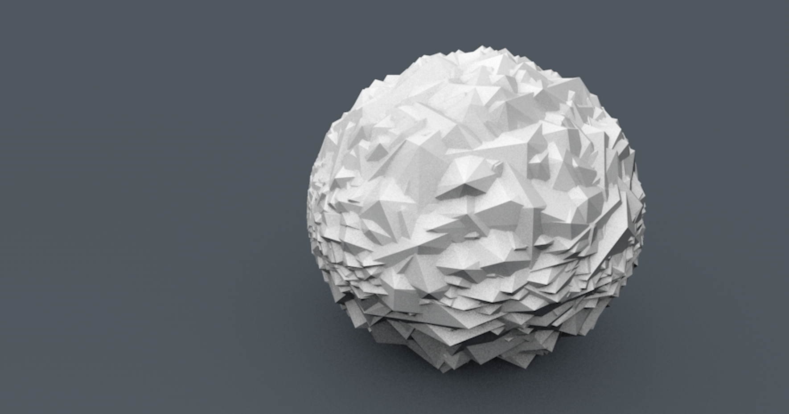

# 3d-quickhull
_Header only 3d quickhull in ANSI C_


```c
#define QUICKHULL_IMPLEMENTATION
#include "quickhull.h"
```

```c
const int n = 100;
qh_vertex_t vertices[n];

for (int i = 0; i < n; ++i) {
    float a0 = (rand_0_1() * M_PI * 2);
    float a1 = (rand_0_1() * M_PI * 2);
    vertices[i].z = sin(a0) * radius;
    vertices[i].x = cos(a1) * cos(a0) * rand_0_1();
    vertices[i].y = sin(a1) * cos(a0) * rand_0_1();
}

qh_mesh_t mesh = qh_quickhull3d(vertices, n);

// ...

qh_free_mesh(meshes);

```


